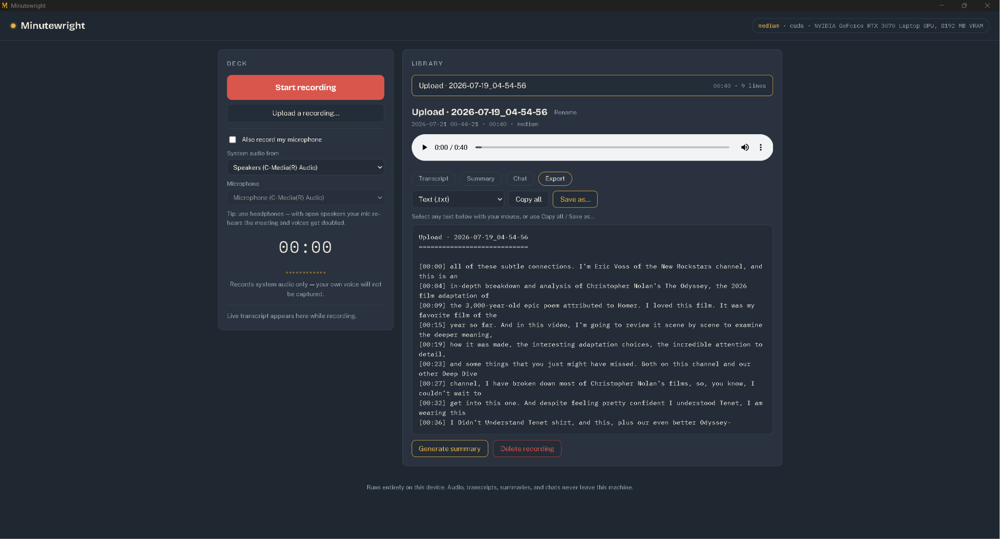

# Minutewright

A local meeting recorder for Windows. It records both sides of your meetings,
transcribes them live, and lets you summarize, chat with, and export the
transcript — all running entirely on your machine. No cloud, no accounts,
nothing leaves your device. You can also upload existing recordings, and
click any word in a transcript to jump the audio to that moment.



**Latest release:** see the [Releases page](../../releases) for downloadable
Windows builds. Build progress and architecture are documented in
[docs/BUILD_GUIDE.md](docs/BUILD_GUIDE.md); full change history in
[CHANGELOG.md](CHANGELOG.md).

## Why "Minutewright"

A wright is a craftsman — wheelwright, playwright, shipwright. This one
crafts meeting minutes.

## For users: download and run

Grab a build from the [Releases page](../../releases):

- **Most people: the Standard build.** Works on every Windows PC.
- **Have an NVIDIA graphics card?** The NVIDIA-GPU build transcribes much
  faster. If unsure, get Standard — it runs everywhere.

Extract the zip and double-click the exe. Windows only (10/11, 64-bit).

On first launch, SmartScreen may warn because the app isn't code-signed
yet — click **More info → Run anyway**. If it still won't launch after
that, Windows has marked the downloaded files as blocked: open PowerShell
in the extracted app folder (right-click an empty space in the folder →
**Open in Terminal**), run `Get-ChildItem -Recurse | Unblock-File`, and
try again. A proper installer that removes this friction is on the
roadmap.

Everything is on-device: recordings, the AI model, and settings live in
`%LOCALAPPDATA%\Minutewright` (and survive app updates untouched). The
Whisper speech model downloads on first recording (a few hundred MB); the
summary/chat model downloads from a button in the app the first time you
use those features (~2 GB). Both are one-time and offline afterward.

## Features

- **Records the whole meeting** — system audio *and* your microphone,
  mixed together, so both sides are captured. Works with Teams, Zoom,
  Meet, or anything that plays through your PC. Choose your speaker and
  mic, or turn the mic off, in the app.
- **Live transcript** while recording, via faster-whisper (OpenAI's
  open-source Whisper, reimplemented for speed).
- **Automatic model selection** — detects your CPU/GPU and picks the
  largest Whisper model that runs in real time, with a safe fallback to
  CPU if a GPU's drivers can't run inference.
- **Upload existing recordings** (.mp3, .m4a, .mp4, .wav, .aac, .ogg,
  .flac, .webm) for a full, high-quality transcript — useful when a
  locked-down work laptop won't run outside apps.
- **Click-to-seek transcript** — click any word to jump the audio there;
  the current line highlights as it plays.
- **AI summaries and chat**, on a language model built into the app
  (Llama 3.2 3B) — no extra software, no setup. Downloads once, runs
  offline.
- **Export anywhere** — turn any transcript into Text, Markdown, HTML,
  PDF, Word, SRT, VTT, JSON, or CSV, with a live selectable preview,
  one-click copy, and a native **Save as…** dialog. Summaries are
  included when present.
- **Right-click menu** — Cut, Copy, Paste, and Select all on text and
  input fields throughout the app.
- **Name, play back, and manage** recordings from the Library.

## Run from source (developers)

```
conda create -n minutewright python=3.11 -y
conda activate minutewright
pip install -r requirements.txt
python desktop.py
```

A native window opens. Developer mode (API tester instead of the window):
`python main.py`, then visit http://127.0.0.1:8737/docs. The endpoint
contract is in [docs/API.md](docs/API.md).

### Optional: GPU acceleration for transcription (NVIDIA)

The default install transcribes on CPU everywhere. With an NVIDIA card,
install the CUDA runtime libraries for a large speed boost to live
transcription:

```
pip install nvidia-cublas-cu12 nvidia-cudnn-cu12
```

The app finds and loads these automatically at startup (including the
Windows DLL-discovery workaround), verifies real GPU inference works, and
falls back to CPU with a clear reason if it doesn't. To check the GPU
path in isolation: `python spikes/gpu_check.py`.

### Building the executables

```
build_exe.bat            :: Standard edition (CPU), windowed
build_exe.bat debug      :: Standard, console visible for debugging
build_exe.bat gpu        :: GPU edition (bundles NVIDIA CUDA DLLs)
build_exe.bat gpu debug  :: GPU, console visible
```

Output lands in `dist\Minutewright\` or `dist\Minutewright-GPU\` —
distribute the whole folder, zipped. (The `build\` folder is disposable
scratch; the runnable app is always in `dist\`.)

## How the transcription model is chosen

| Hardware found                  | Model chosen             |
|----------------------------------|---------------------------|
| NVIDIA GPU with 9 GB+ VRAM       | large-v3-turbo (float16)  |
| NVIDIA GPU with 6–9 GB VRAM      | medium (float16)          |
| NVIDIA GPU with 3.5–6 GB VRAM    | small (int8_float16)      |
| CPU, 8+ cores and 8 GB+ RAM      | small (int8)              |
| CPU, 4+ cores                    | base (int8)               |
| Anything weaker                  | tiny (int8)               |

## Known limitations & roadmap

Current limits: summaries and chat run on CPU in both editions (a minute
or two per summary); live captions arrive in ~5-second chunks; uploaded
files transcribe more cleanly than live recording; no speaker labels; for
the cleanest recording use headphones so your mic doesn't re-hear the
meeting.

Roadmap: a proper installer (removes the SmartScreen/unblock friction);
GPU-accelerated summaries and chat; word-level streaming captions;
speaker labels (who said what) via diarization; chunked summaries for
very long meetings; search across all meetings; code signing.

## Running the tests

```
pytest
```

## Attribution

Speech recognition uses OpenAI's open-source Whisper via faster-whisper.
AI summaries and chat are **Built with Llama** (Meta Llama 3.2, used
under the Llama 3.2 Community License).

## License

Apache License 2.0 — see [LICENSE](LICENSE).